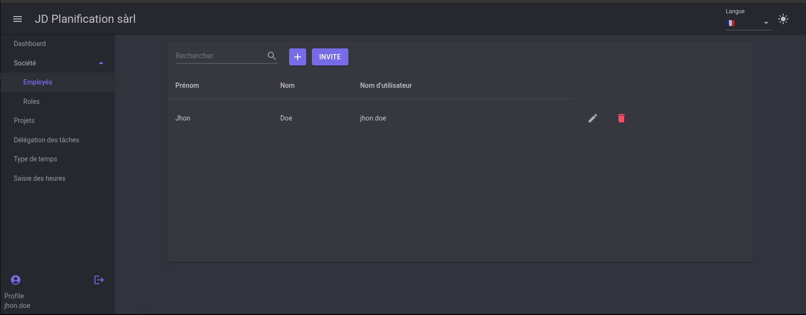
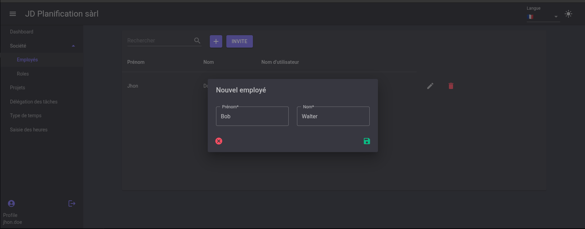
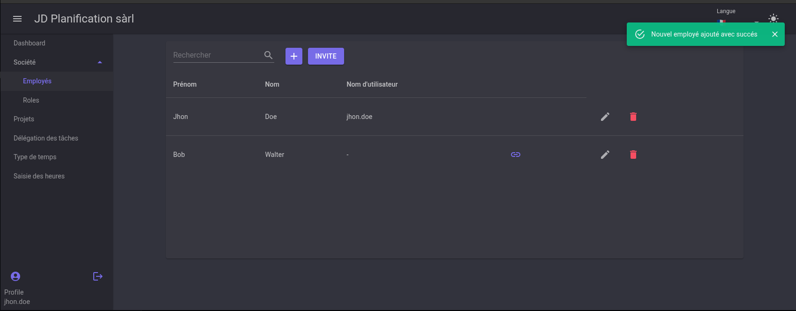
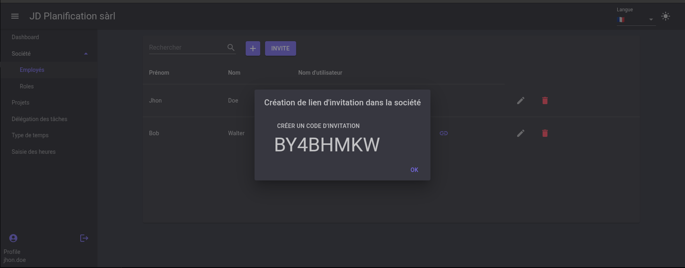
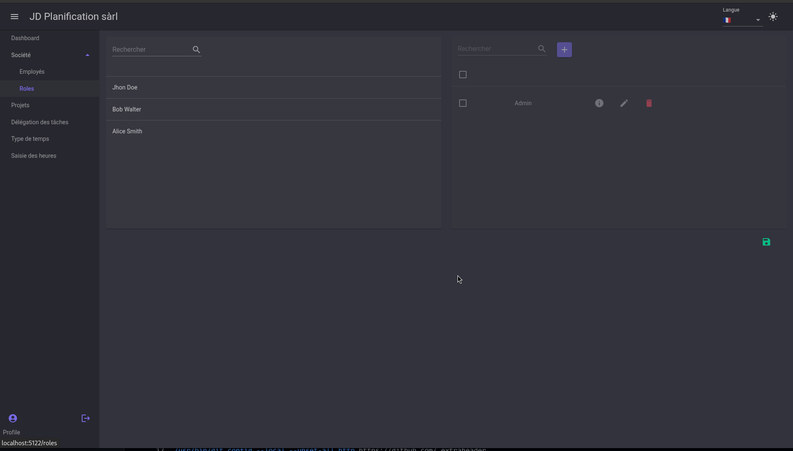
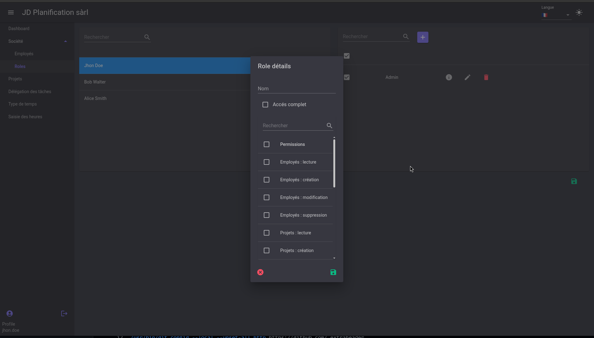
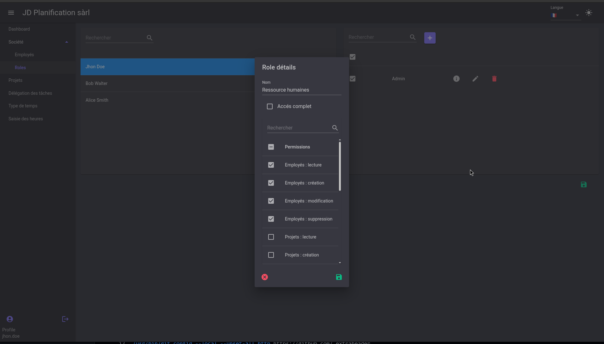
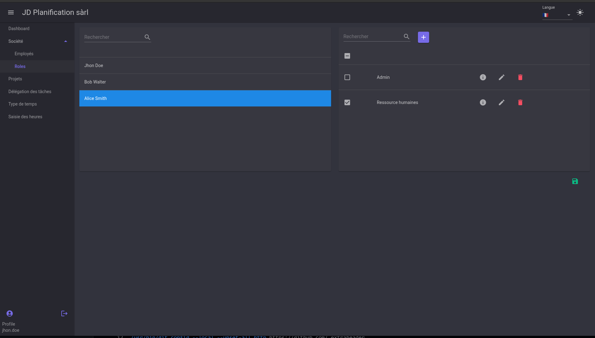
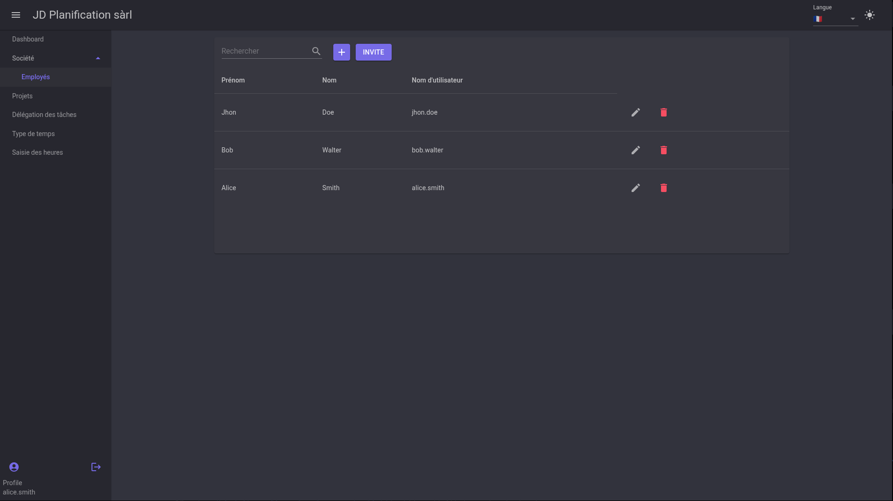

# Company

In this section, we will see how to manage company members and their roles.

## Employees

To add an employee to your company, click the `+` button at the top of the list.

Fill out the form with the required information, then click the green save button at the bottom right of the dialog window.

You will see the new employee appear in the company employee list with a small link symbol. This symbol indicates that the employee is not linked to a user account.

By clicking this symbol, you can create an invitation code to give to the user.

The user will then enter this invitation code as explained in the [Register](./register.en.md) section.

!!!note
    To invite the employee and allow them to create the employee as soon as they enter the invitation code, simply click the `INVITE` button and give the code to the user.

## Roles
Roles contain permissions, which allow actions to be performed in the application. By default, a role called `Admin` is created and has full access to the application.

!!! warning Note
    At least one user in the company must have a role with full access. The application will not allow role modifications if this condition is not met.

### Assign roles

Once a user is selected in the left list, you can modify the roles assigned to them by selecting roles in the right list.

!!! note
    Role details can be viewed by clicking the small  next to the role name.

### Create a role

To create a role, click the `+` button at the top of the roles list.

Enter a name for the role, then you have two options:

1. Create a role with full access by checking the `Full access` box.
2. Create a role with custom permissions by unchecking the `Full access` box and selecting permissions from the list.

In the second case, we will create a `Human Resources` role with access to employee management.

Once this role is created, we will assign it to a user, in our case, user `Alice`.

!!! warning Attention
    Don't forget to click the green save button at the bottom right of the window to save changes. Otherwise, selections will not be applied.

Here is what user `Alice` sees in her interface after refreshing the page.

Alice can see the list of company employees but does not have access to roles or permissions. She cannot modify other users' roles.
