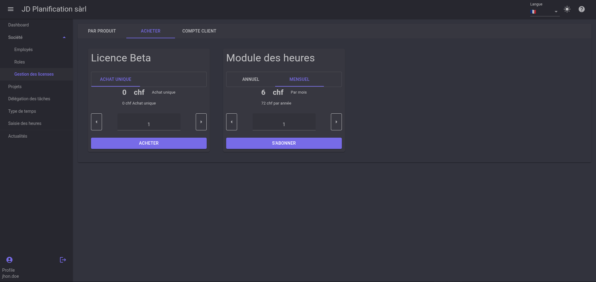
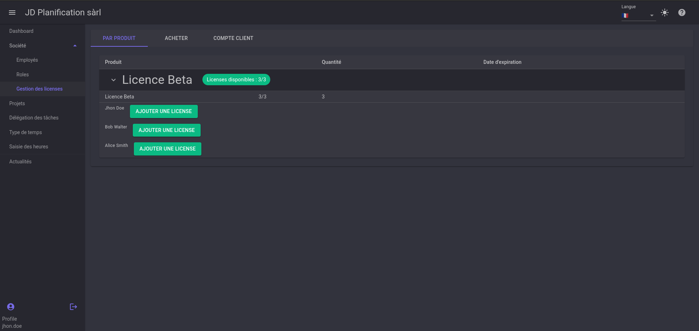
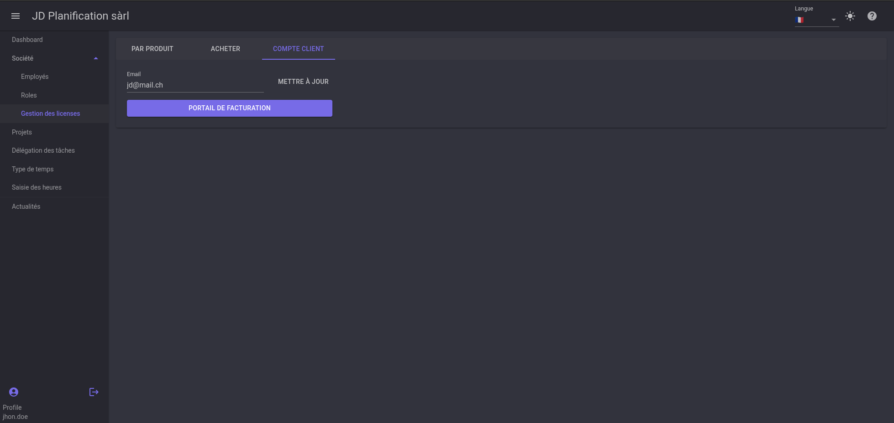

# License Management

In this section, we will see how to manage application licenses.

## Purchase a License

To use certain modules of the application, you need to purchase a license. To do this, go to the license purchase page.

Choose the product you wish to purchase. You will be redirected to the payment page.

## Assign a License

Once the payment is complete, return to the license management page and go to the `BY PRODUCT` tab. You will see the list of licenses you have purchased. Expand the license and click on `ADD LICENSE` for the user who should receive it.

## Manage Licenses

Licenses can be managed from the billing portal. To access it, go to the `CUSTOMER ACCOUNT` tab and click on `BILLING PORTAL`. You will be redirected to the billing portal where you can manage your licenses, change the quantity, cancel a subscription, etc.

