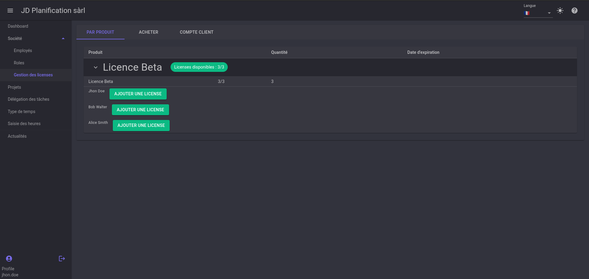
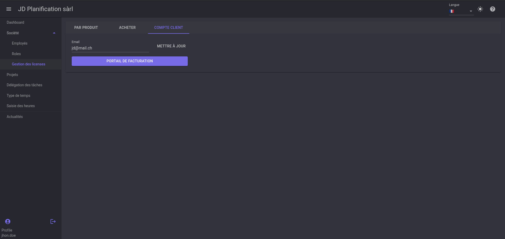

# Gestion des licences

Dans cette section, nous allons voir comment gérer les licences de l'application.

## Acheter une licence

Afin de pouvoir utiliser des modules de l'application, vous devez acheter une licence. Pour cela, rendez-vous sur la page d'achat de licences.

Choisissez le produit que vous souhaitez acheter. Vous serez redirigé vers la page de paiement.

## Attribuer une licence

Une fois le paiement effectué, revenez sur la page de gestion des licences et allez sur l'onglet `PAR PRODUIT`. Vous verrez la liste des licences que vous avez achetées. Développez la licence et cliquez sur `AJOUTER UNE LICENCE` sur l'utilisateur qui doit en bénéficier.

## Gérer les licences

Les licences peuvent être gérées depuis le portail de facturation. Pour y acceder, Allez dans l'onglet `COMPTE CLIENT` puis cliquez sur `PORTAIL DE FACTURATION`. Vous serez redirigé vers le portail de facturation où vous pourrez gérer vos licences, modifier la quantité, annuler un abonnement, etc.

