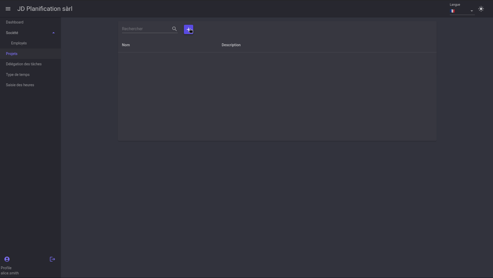
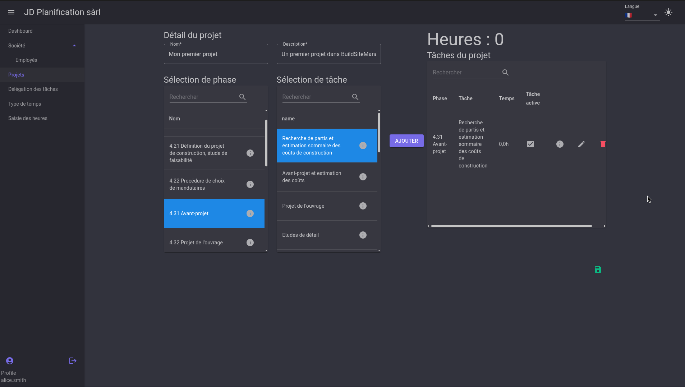
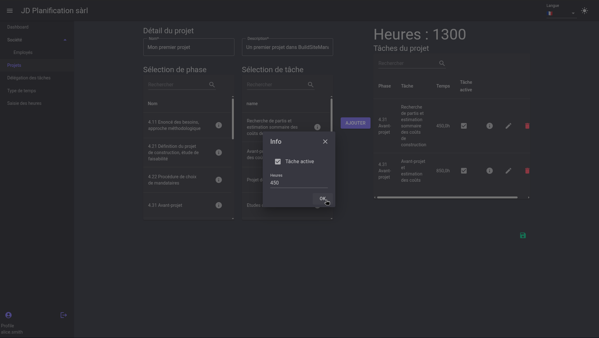
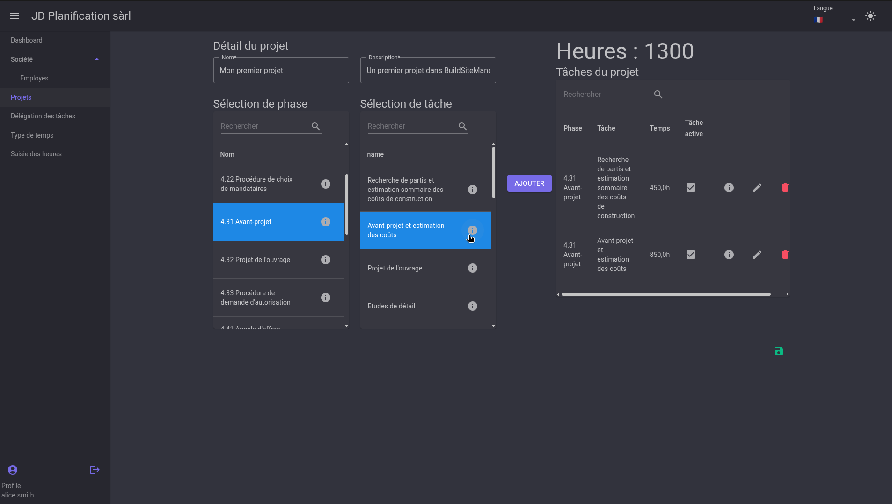

# Projets

Cette section explique comment créer un projet et définir les phases et les tâches associées.

## Créer un projet

Pour créer un projet, cliquez sur le bouton `+` en haut de la liste des projets. 

Une nouvelle fenêtre s'ouvre, vous permettant de saisir les informations du projet, à savoir, son nom et sa description. 

Puis, dans les listes, il est possible de sélectionner une phase et une tâche associée et d'ajouter l'assemblage phase/tâche au projet en cliquant sur `AJOUTER` 

## Éditer un élément du projet

Maintenant que la tâche est créée, on a la possibilité de déterminer un nombre d'heures pour cette tâche ou même de la désactiver.

Pour cela, cliquez sur l'icône de crayon à côté de la tâche. Une fenêtre s'ouvre, vous permettant de saisir le nombre d'heures et de désactiver la tâche si nécessaire.

Une fois les éléments du projet définis, le total des heures à disposition est affiché. 

!!! warning Attention
    Afin de sauvegarder les modifications, il est nécessaire de cliquer sur le bouton sauvegarder en vert en bas à droite de la fenêtre.