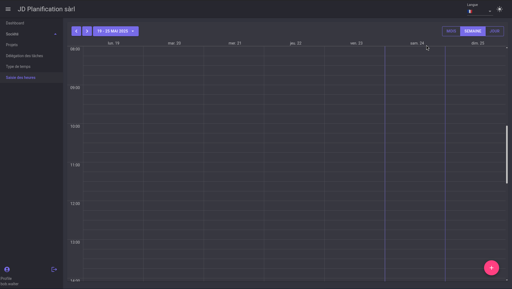
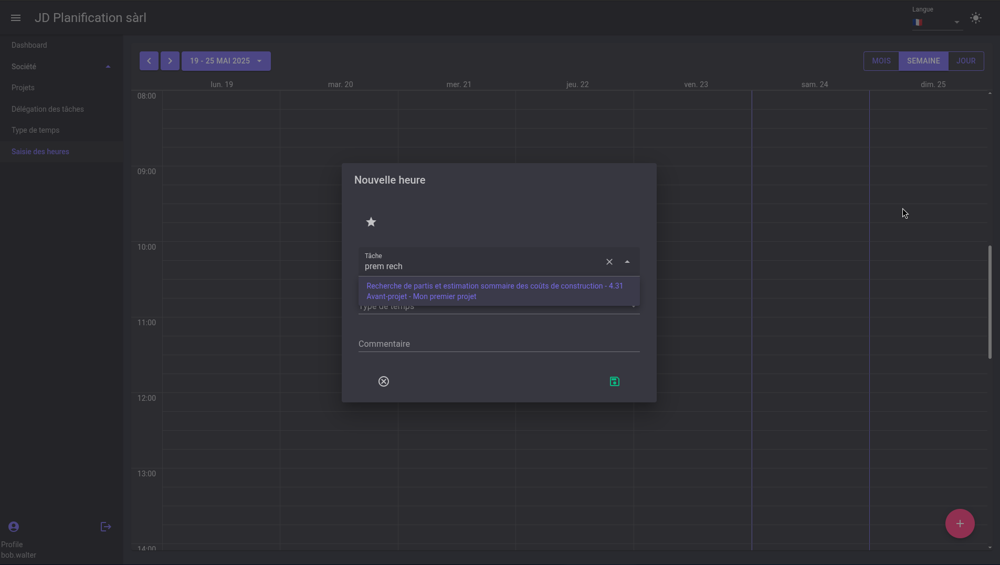
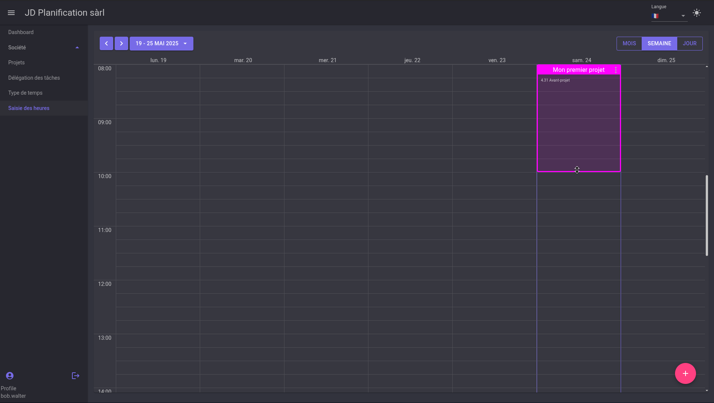
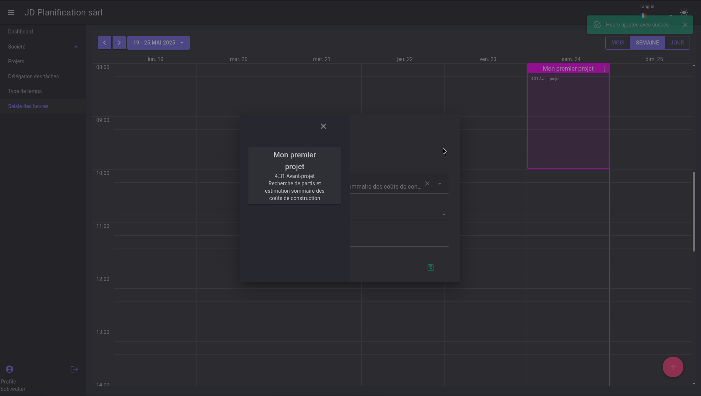
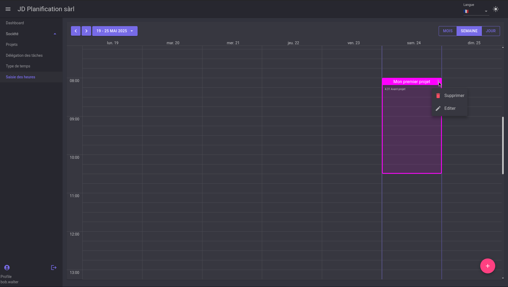
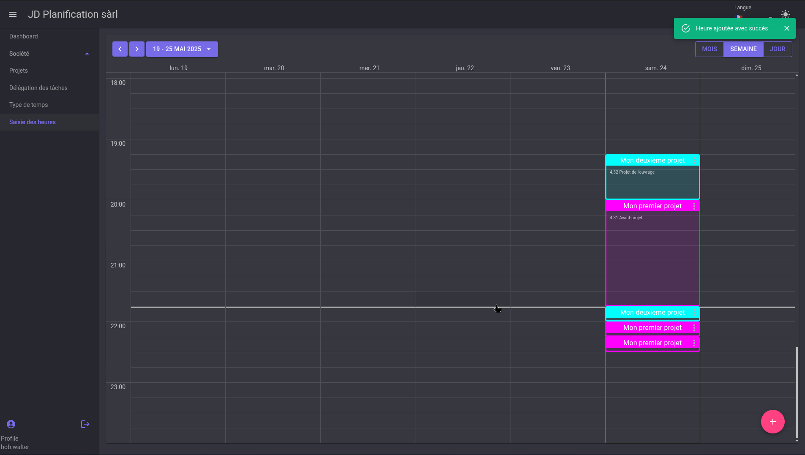

# Timesheet Calendar

This section explains how to enter hours in the timesheet calendar.

By default, the timesheet calendar has cells of 15 minutes and is displayed in day/week/month format.



## Entering Hours

By clicking on a cell in the calendar, a page opens and allows you to select a project item for which the user is authorized to log hours.


### Quickly Search for a Project
To quickly search for a project, simply enter keywords in the search field.

For example, if the task is named:
```Recherche de partis et estimation sommaire des coûts de construction - 4.31 Avant-projet - Mon premier projet```

then you just need to enter parts of keywords like `partis`, `estimation`, `mon premi`, `proj`.

With the words `prem` and `rech`, the task will be found.



### Entering Hours

Once the project is selected, simply select the type of hour and add a comment if necessary.

Once validated, click the green save button at the bottom right of the dialog window.
Then stretch the cell to set the duration of the entered hour.


### Using Favorites

Once hours have been entered, the favorites option provides quick access to the last entered projects for ultra-fast entry.

By clicking on the small star above the task list, the last entered projects are displayed.



### Edit or Delete an Entered Hour

By clicking on the three dots to the right of the cell, a menu appears to edit or delete the entered hour.



### Using the Time Counter

A pseudo time counter is available to enter hours. The pink button at the bottom right of the screen allows you to enter an hour with its duration under a few conditions:

- The entered hour is for the current day
- The entered hour starts at the end of the last entered hour and extends to the current time
- If no hour has been entered, then the hour starts at 8:00 AM and extends to the current time
- If an already entered hour exceeds the current time, then a new cell is added after it.



