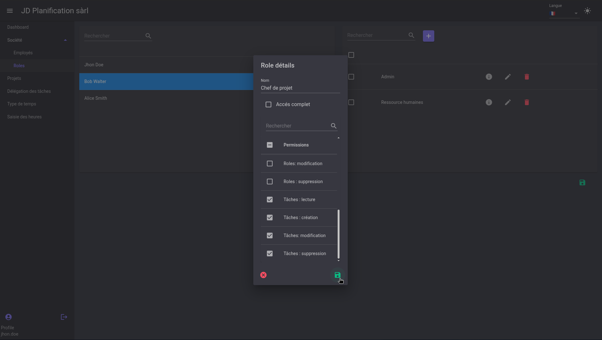
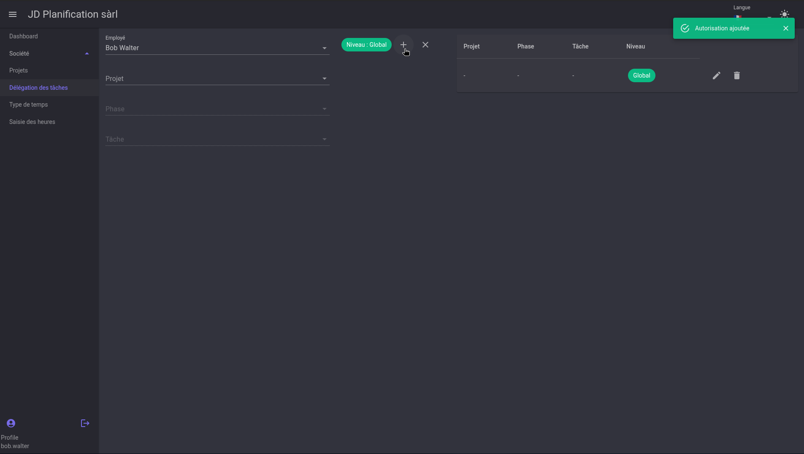
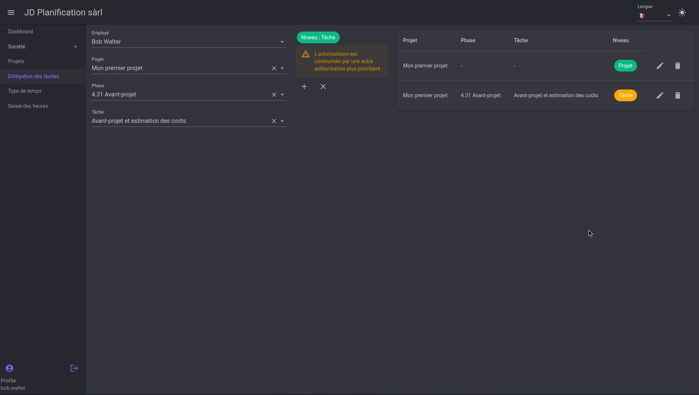

# Task Authorizations

This section explains how a project manager can authorize a user to log hours on project tasks.

!!! warning Attention
    To be able to enter authorizations, the user must have the necessary permissions.

    

## Authorization Levels

Authorizations can be defined at several levels:
- **Global**: The user can log hours on all tasks of all projects.
- **Project**: The user can log hours on all tasks of a specific project.
- **Phase**: The user can log hours on all tasks of a specific phase of a project.
- **Task**: The user can log hours on a specific task of a project.

### Define a **Global** Level Authorization

To define a global level authorization, simply select the user and leave the three dropdown lists empty.

By pressing the `+` button, the authorization will be created and the user will be able to log hours at the global level.

### Define a **Project** Level Authorization

To define a project level authorization, select the user, the project, and leave the other two dropdown lists empty.

Similarly, by pressing the `+` button, the authorization will be created and the user will be able to log hours on all tasks of the project.

### Define a **Phase** or **Task** Level Authorization

To define a phase or task level authorization, select the user, the project, the phase, or the phase and the task.

!!! info
    If the user already has an authorization, and a lower-level authorization is entered, a warning message will appear to indicate that the authorization will be overridden by a higher-priority one.
    
