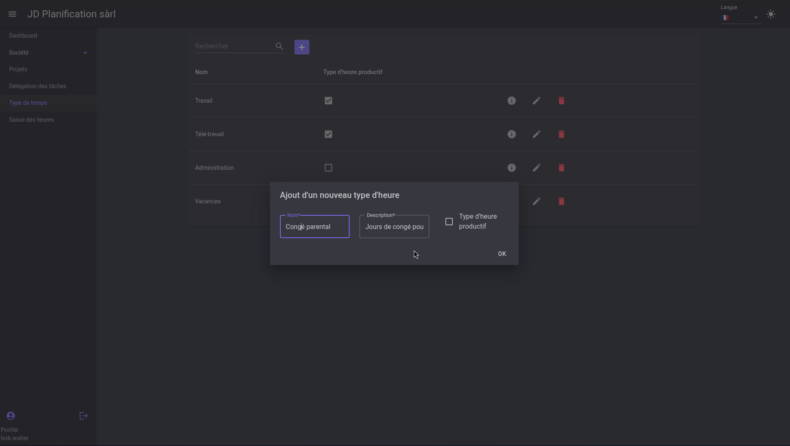

# Time Types

This section explains how to create and manage types of hours.

There are mainly two types of hours:
- **Productive**: Billable hours.
- **Non-productive**: Non-billable hours.

In this section, you can create hour types that define the nature of the hours entered by users.

## Create a Time Type

To create a time type, click the `+` button at the top of the list of hour types.
In the window that opens, enter the information for the hour type and select whether it is a **Productive** or **Non-productive** hour type, then click save.

